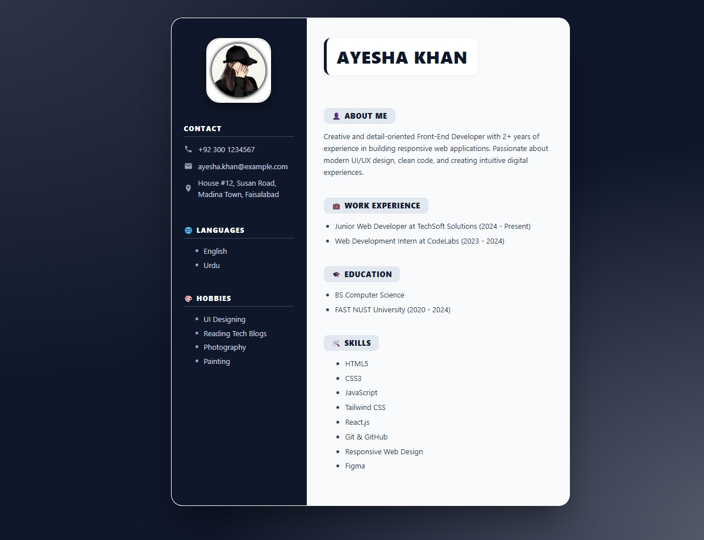
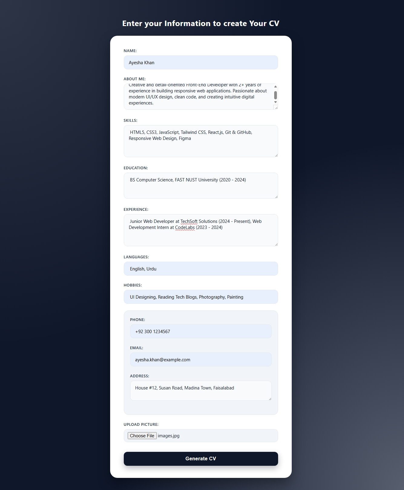

# CV Generator 

A simple and user-friendly CV Generator built with HTML, CSS, and JavaScript.
This project allows users to enter their personal and professional information and instantly generate a formatted CV. 

## 📌 Project Overview 

The CV Generator provides a form where users can enter information such as: 

→ Name 
→ About Me 
→ Skills 
→ Education 
→ Work Experience 
→ Languages 
→ Hobbies 
→ Phone Number 
→ Email 
→ Address 
→ Profile Picture 

After submitting the form, the entered information is dynamically displayed in a professional CV template. 

##🛠️ Technologies Used 
→ HTML5 – Structure of the application 
→ CSS3 – Styling and CV layout 
→ JavaScript – Dynamic CV generation and image handling 

##📂 Project Structure 
CV-Generator/ 
│ 
├── index.html 
├── styles.css 
├── index.js 
└── README.md 

## Project ScreenShots
 

##👩‍💻 Author 
HAADIA BATOOL
